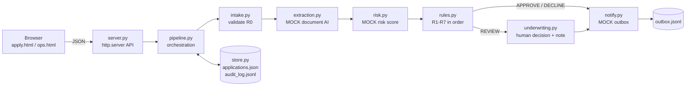
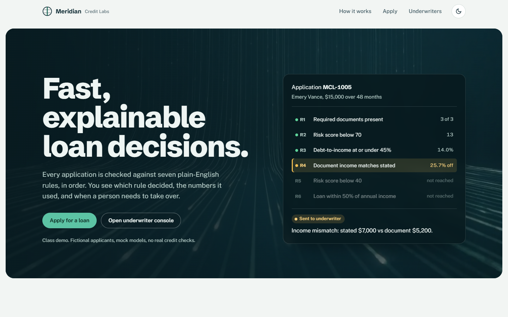
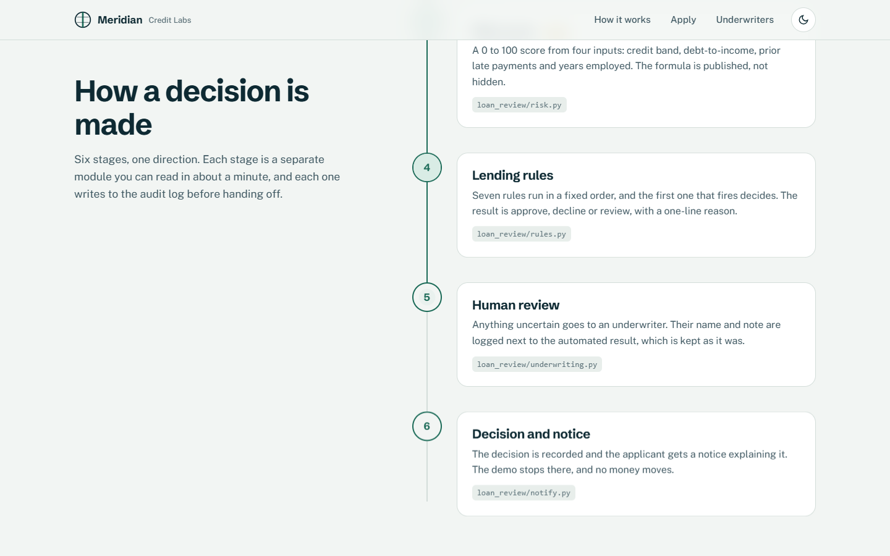
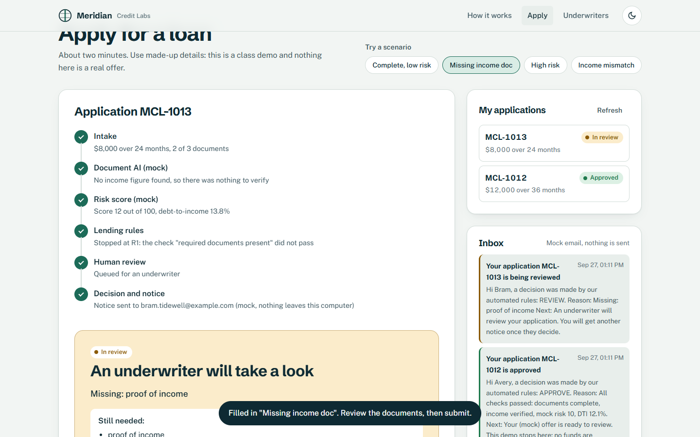
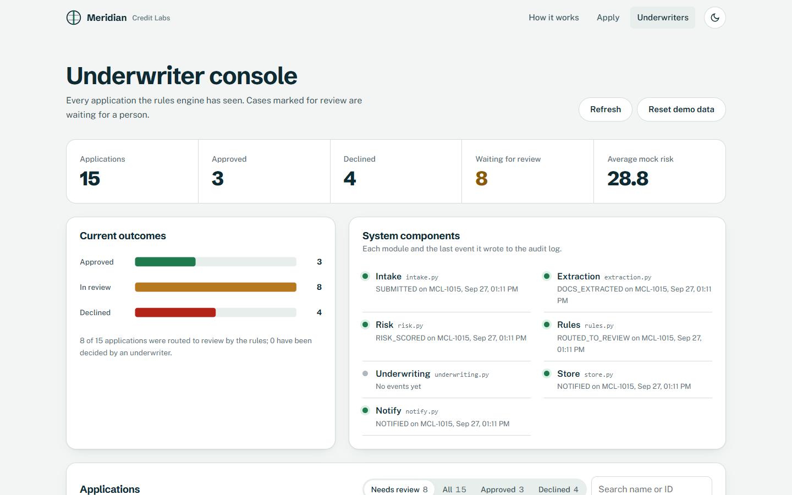
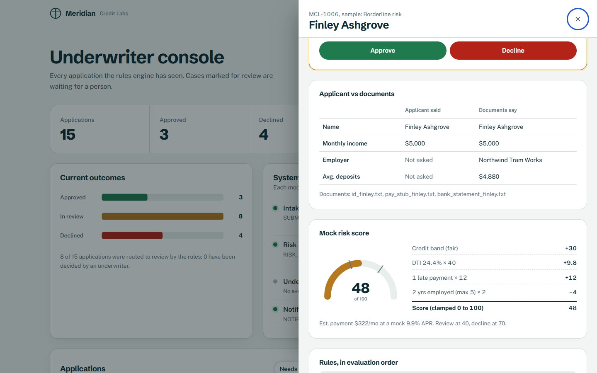
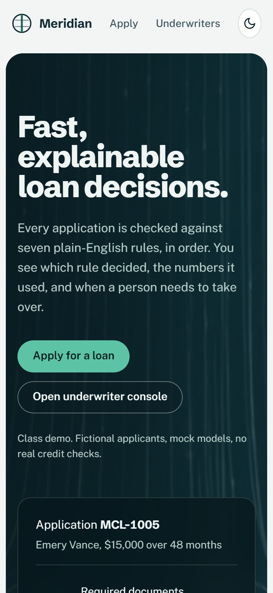
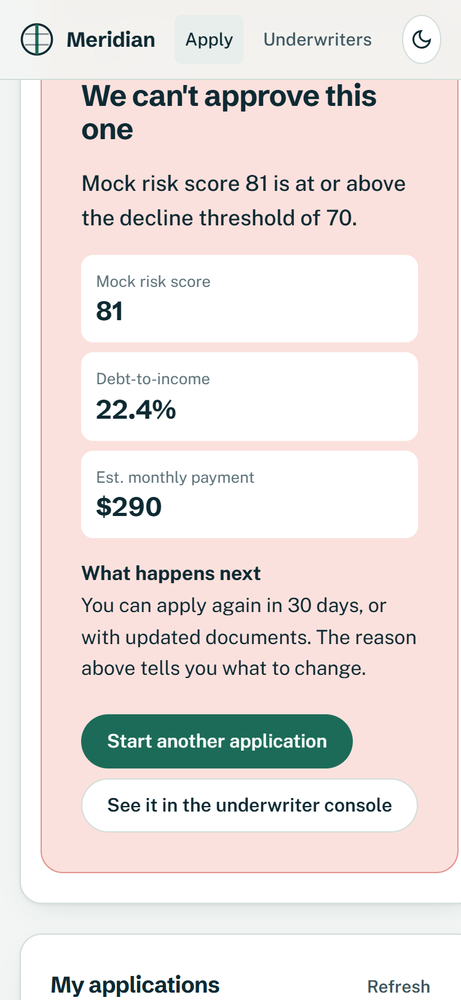
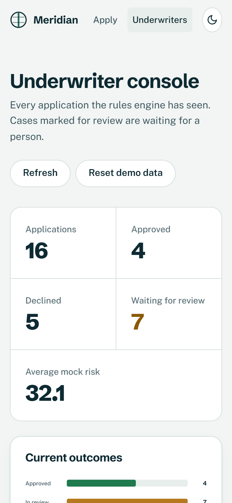

# Meridian Credit Labs: explainable loan review (class demo)

> **Class demo. Fictional data. Not a real credit model or lending offer.**
> Every applicant, document, score and notification in this project is made up.

| | |
|---|---|
| **Name** | Ahmad Abuadas |
| **Course** | FIT6050 |
| **Implemented component** | Loan-review decision engine (intake, mock document extraction, mock risk score, toy lending rules, human underwriting, audit log, mock notification) + web UI (landing page, applicant dashboard, underwriter console) |

Meridian Credit Labs is a fictional digital lender. This project builds the part of its system
that goes from **application intake** to **"decision recorded and applicant notified"**. It is
small on purpose: each stage is one readable module, every decision carries a plain-English
reason, and anything uncertain goes to a human.

---

## Run it

Python 3.10+ and the standard library only. Nothing to install and no build step.

```bash
python main.py                 # console demo: runs every sample scenario and prints a table
python -m unittest -v          # 23 tests, all passing
python main.py serve           # web app on http://127.0.0.1:8000 (localhost only)
python main.py serve --port 8080
```

The server seeds 7 sample applicants on first start. Runtime data is written to `data/`,
which is git-ignored. The **Reset demo data** button (or `POST /api/reset`) reloads the samples.

Pages:

- `/` shows the landing page and explains the pipeline.
- `/apply.html` is the applicant dashboard: a multi-step form, "Try a scenario" quick-fills, an animated result, My applications, and a mock inbox.
- `/ops.html` is the underwriter console: KPIs, an outcome chart, component status, the review queue, and a detail drawer with the underwriter action.

---

## Architecture



| Module | Responsibility |
|---|---|
| `loan_review/models.py` | Dataclasses: `Application`, `Document`, `ExtractedFields`, `RiskResult`, `Decision`, `AuditEvent` |
| `loan_review/intake.py` | Validates and normalises input and raises `ValueError` on bad input (rule R0) |
| `loan_review/extraction.py` | **Mock** "document AI": regex over `.txt` docs for employer, monthly income, ID name, and bank deposits |
| `loan_review/risk.py` | **Mock** risk score 0-100 plus DTI and the estimated payment |
| `loan_review/rules.py` | Toy lending rules R1-R7 with every threshold in one `THRESHOLDS` dict |
| `loan_review/underwriting.py` | Human decision. REVIEW cases only, name and note required, one decision per case, and the automated decision is never overwritten |
| `loan_review/store.py` | Write-once application records plus an append-only JSONL audit log (thread-safe) |
| `loan_review/notify.py` | **Mock** notification appended to `data/outbox.jsonl`. No email is sent |
| `loan_review/pipeline.py` | Wires the stages together and writes one audit event per state change |
| `loan_review/server.py` | JSON API plus static files. Errors come back as JSON without stack traces |

### Records and audit

- An application record is **written once** at submission. It holds the input, the extracted fields, the risk result and the automated decision.
- Every state change after that is a new line in `data/audit_log.jsonl`, with a `timestamp`, `actor` and `details`:
  `SUBMITTED → DOCS_EXTRACTED → RISK_SCORED → RULES_APPLIED → (ROUTED_TO_REVIEW) → NOTIFIED → (UNDERWRITER_DECISION → NOTIFIED)`.
- The current status is **derived** from the record plus its events. An underwriter decision is only an extra event, so the original automated decision stays visible.
- The flow stops at "decision recorded and applicant notified". Nothing is disbursed.

---

## Lending rules (toy)

Required documents: `government_id`, `proof_of_income`, `bank_statement`.
Rules are evaluated **in this exact order, and the first rule that fires decides**. Every evaluated rule
is recorded in `rules_fired` with the values it used.

| # | Rule | Outcome |
|---|---|---|
| R0 | Invalid input: non-numeric or negative amount, missing name, or term not in {12, 24, 36, 48, 60} | `ValueError` (the web app shows a friendly 400 error) |
| R1 | Any required document is missing | **REVIEW**, with a reason that names each missing item, e.g. "Missing: proof of income" |
| R2 | Mock risk score ≥ 70 | **DECLINE** |
| R3 | DTI = (monthly debts + est. new payment) / monthly income > 45% | **DECLINE** |
| R4 | Document income differs from stated income by > 15% (or no income could be read) | **REVIEW**, "Income mismatch: stated $X vs document $Y" |
| R5 | Mock risk score 40-69 | **REVIEW** (borderline, routed to an underwriter) |
| R6 | Loan amount > 50% of annual stated income | **REVIEW** |
| R7 | Otherwise: risk < 40, DTI ≤ 45%, documents complete, income verified | **APPROVE** |

Every decision returns `outcome`, `reason`, `rules_fired`, `risk_score`, `dti`, `decided_by`
(`"rules-engine"` or the underwriter's name), `timestamp`, and `missing_items`.

## Mock risk score

```
risk = band_points[credit_band]          excellent 5, good 15, fair 30, poor 50, very_poor 65
     + 40 × min(DTI, 1.0)
     + 12 × prior_delinquencies
     −  2 × min(years_employed, 5)
clamped to 0..100, rounded to a whole number

DTI                = (monthly_debts + estimated_payment) / stated_monthly_income
estimated_payment  = amortised payment on the loan at a MOCK 9.9% APR over the chosen term
```

The formula is deterministic, and each term is stored in `risk.components`, so the console can show
the score as a sum. The credit band is self-reported and fictional. No bureau is contacted.

---

## API

| Method and path | Purpose |
|---|---|
| `POST /api/applications` | Submit. The body is the application JSON, with `documents: [{type, filename, text}]` (the browser reads `.txt` uploads with `FileReader`). Returns the full record and decision (201) |
| `GET /api/applications` | Summary list for the ops dashboard |
| `GET /api/applications/{id}` | Detail: input, extracted fields, risk, rules fired, decisions, audit trail |
| `POST /api/applications/{id}/review` | `{reviewer, outcome: "APPROVE" \| "DECLINE", note}`. Only for REVIEW cases |
| `GET /api/stats` | Counts by outcome, review-queue size, average risk, and last event per component |
| `POST /api/reset` | Reload the sample data (demo convenience) |
| `GET /api/samples` | Sample applicants with document text, used by the quick-fill and "Use sample" buttons |
| `GET /api/outbox?ids=MCL-1001,...` | Mock notification inbox |

Bad input returns **400** `{"error": "..."}`, an unknown ID or route returns **404**, and a body over 1 MB returns **413**. Unexpected errors
return a generic 500, and the traceback is printed only on the server console. The server binds to
`127.0.0.1`, disables directory listings, sets `nosniff` and a Content-Security-Policy, and never
serves files outside `web/`.

---

## Example console output

Real output of `python main.py`:

```
Meridian Credit Labs - loan review demo (fictional data, mock models)

applicant        risk  DTI    outcome  reason
---------------  ----  -----  -------  ----------------------------------------
Avery Quill      10    12.1%  APPROVE  All checks passed: documents complete, income verified, mock risk 10, DTI 12.1%.
Bram Tidewell    12    13.8%  REVIEW   Missing: proof of income
Cleo Farrow      81    22.4%  DECLINE  Mock risk score 81 is at or above the decline threshold of 70.
Dax Holloway     33    60.6%  DECLINE  Debt-to-income ratio 60.6% exceeds the 45% maximum (debts $1,500 + est. payment $922 on income $4,000/mo).
Emery Vance      13    14.0%  REVIEW   Income mismatch: stated $7,000 vs document $5,200 (25.7% difference).
Finley Ashgrove  48    24.4%  REVIEW   Borderline mock risk score 48 (40-69); routed to an underwriter.
Greer Lumen      3     20.9%  REVIEW   Loan amount $30,000 is more than 50% of annual income ($48,000); routed to an underwriter.

Failure case (R0 - invalid input):
  loan_amount=-500 -> ValueError: Loan amount cannot be negative.

39 audit events written, 7 mock notices in the outbox.

Run 'python main.py serve' to open the web app.
```

The seven sample applicants cover every rule from R1 to R7. The brief asked for 5-6; I used seven so that R6 also has a case.

## Tests

`python -m unittest -v` runs 23 tests in `test_main.py`, each using a temporary storage directory:

- complete application with low risk gives APPROVE (R7)
- missing proof of income gives REVIEW, and the reason names "proof of income" (R1)
- high risk gives DECLINE (R2), and DTI too high gives DECLINE (R3)
- income mismatch gives REVIEW (R4); borderline risk (R5) and a large loan (R6) give REVIEW
- rule order holds: missing documents beats high risk
- a negative amount raises `ValueError`, other invalid inputs are rejected, and nothing is stored on failure
- extraction pulls the employer and income from a sample pay stub, with an annual-salary fallback
- the risk score is deterministic and clamped
- an underwriter decision becomes a new audit event, the automated decision is preserved, the decision is rejected on non-REVIEW cases, and name, note and single-decision checks are enforced
- store round-trip, write-once records, audit events for every stage, and an outbox entry
- API smoke test: the server starts on a random port in a thread, a POST is fetched back with GET, 400 and 404 return JSON without a traceback, and the static index is served

---

## Screenshots

| | |
|---|---|
| Landing, 1440px  | Scroll-driven pipeline  |
| Applicant result (missing document)  | Underwriter console  |
| Detail drawer: applicant vs documents, risk gauge  | Mobile, 375px  |
| Mobile applicant decision  | Mobile console  |

## Website notes

- The frontend is plain HTML, CSS and vanilla JS with no libraries. The only external request is Google Fonts, and the pages fall back to system fonts offline.
- Light and dark themes use CSS-variable tokens. The page follows the OS setting and has a manual toggle.
- The landing page uses CSS scroll-driven animations (`animation-timeline: view()/scroll()`): the pipeline line draws itself, stages reveal in order, and the hero has parallax. Browsers without support get an IntersectionObserver fallback. With `prefers-reduced-motion`, all motion is off, final states show, and the video is paused.
- The two hero and section videos are abstract loops generated with Higgsfield (Kling 3.0 Turbo). They were re-encoded to seamless 4-second H.264 loops (550 KB and 186 KB) with WebP/JPG posters. The page still looks complete without them.
- Verified at 1440px and 375px, with no horizontal scroll, keyboard navigation (skip link, focus-trapped drawer, Esc to close), visible focus rings, labelled inputs, and no console errors.

## Limitations

- **Not a credit model.** The risk formula and thresholds are toy values, chosen so each sample lands on a different rule.
- The rules are first-match. A declined applicant is told only the first failing rule, not every problem.
- Extraction only understands labelled plain-text lines. It does no OCR, handles no PDFs or images, and doesn't detect tampering.
- There is no authentication. Anyone who can reach the local server can act as an underwriter. "My applications" is tracked in the browser's `localStorage`.
- JSON files with a process-wide lock are fine for one local user but are not a database. The audit log is append-only by convention, not cryptographically.
- The name on the ID is shown to the underwriter but is not a rule.

## Mocks

| Mock | What it stands in for |
|---|---|
| Document extraction (`extraction.py`) | OCR and a document-understanding model |
| Risk score (`risk.py`) | A real credit-risk model and a bureau pull |
| Credit band | A credit bureau score (self-reported here) |
| 9.9% APR | Real pricing |
| Notifications (`notify.py`, `data/outbox.jsonl`) | Email or SMS delivery |
| Data (`sample_data/`) | Real applicants and documents. All names, employers and banks are fictional, and emails use `example.com` |
